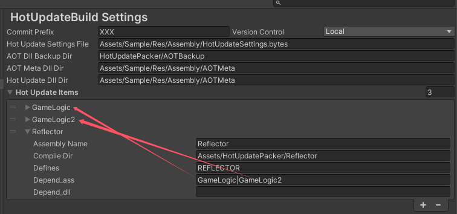

# HotUpdatePacker

[CSDN](https://blog.csdn.net/xinjay1992/article/details/149230040) |[Github](https://github.com/xinjay/HotUpdatePacker) | [Gitee](https://gitee.com/xinjay/hot-update-packer)

HotUpdatePacker是针对HybridCLR的一项扩展，支持依赖于**默认程序集**（Assembly-CSharp.dll)的子程序集热更。

方案使用了HybridCLR带来的**近乎完美**的全平台原生C#热更技术，同时抓住部分项目因各种原因而难以使用unity “Assembly Definition”拆分程序集，而又不能将默认程序集热更的痛点。比如项目早期没有规划好程序集，导致大量代码耦合在默认程序集中；又或者使用了XLua而难以将生成的LuaWrap从默认程序集中剥离出来热更的情况。

## 特性

- 支持自定义依赖于默认程序集的子程序集打包及热更；

- 热更程序集之间可以无限制调用AOT程序集，包括默认程序集；

- 热更程序集之间支持单向依赖的访问，比如热更程序集A调用热更程序集B中的类、方法等；

- 支持打包后AOT程序集的自动备份及提交版本管理系统；

- 简化了HybridCLR打包流程，便于与现有打包流程集成，以支持Jenkins之类的自动化平台；

- 无缝集成[Obfuz](https://github.com/focus-creative-games/obfuz)代码加固混淆方案；

## 支持的版本与平台

与HybridCRL完全一致；

## 工作原理

核心原理很简单，即采用类似于#if UNITY_EDITOR|XXXX   #endif 的宏命令将热更代码括在中间，在正常编译完HybridCLR热更程序集后，调用Unity内置AssemblyBuilder并设定好依赖及宏命令XXX后即可编译出依赖于默认程序集的dll。

## 使用约定

- 在从默认程序集中拆分出部分依赖于默认程序集的子程序集时，或者自定义依赖于默认程序集的子程序集时，必须确保没有任何AOT程序集直接引用需要热更的程序集；

- 热更子程序集之间支持单向依赖的访问，很好理解，避免循环引用嘛；

- 在定义热更程序集时被依赖的程序集需要放前面，如下：
  
  

## 未来计划

- 持续优化HotUpdatePacker方案；

- 接入XLua拆分出LuaWrap以支持LuaWrap热更；

## 参考

演示demo(HotUpdatePackerDemo) [Gitee](https://gitee.com/xinjay/hot-update-packer-demo) | [Github](https://github.com/xinjay/HotUpdatePackerDemo)
